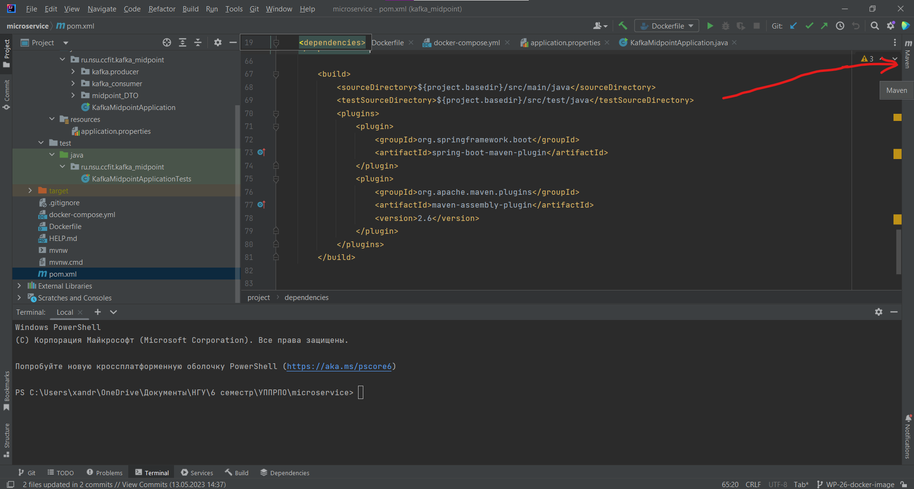
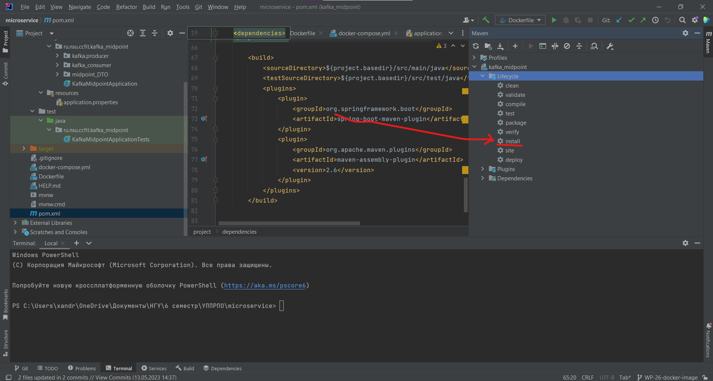

# Short guide on application containerization using Maven

##### First you need to install the Maven and open it.
###### For example, in IDEA it looks like this:

##### Now go to the "kafka_midpoint" project and then go to the "Lifecycle" directory.
##### You will need "clean" and "install". If you already have a docker image, it should be deleted before starting, otherwise an error may occur. To do this double-click "clean". To get docker image, double-click "install".
###### In IDEA
